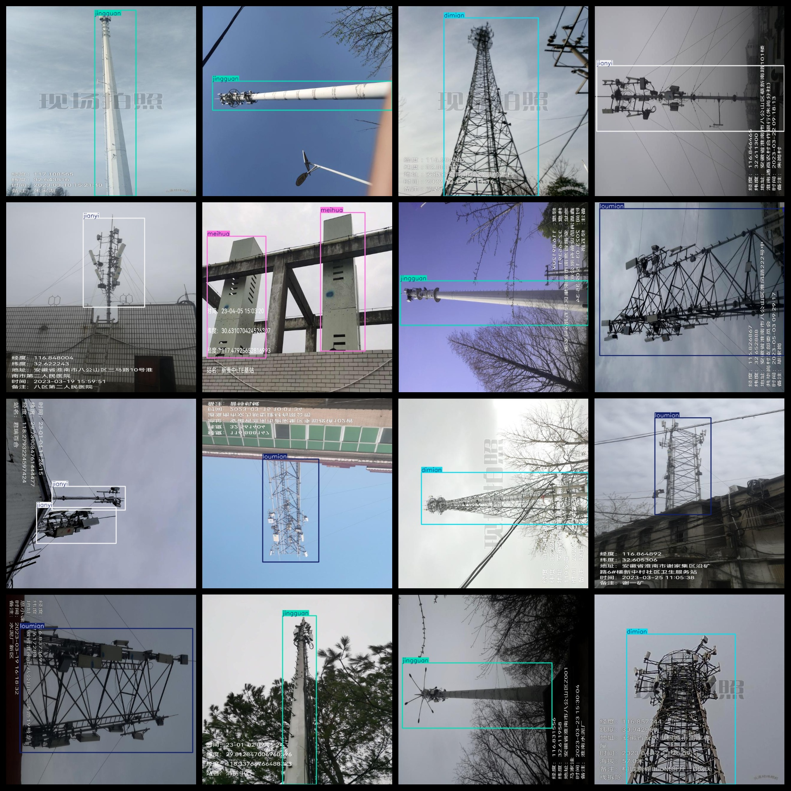

# tower Classification Detection Dataset 2952 imagesVOC+YOLO format

Tower classification detection dataset 2952 VOC + YOLO format

Dataset format: Pascal VOC format + YOLO format (the txt file does not contain the split path, it only contains jpg images and corresponding VOC format xml files and yolo format txt files)

Number of images (number of jpg files): 2952

Number of xml files: 2952

Number of annotations (number of txt files): 2952

Number of categories: 6

The Github repository is: datasets_sl

["baogan", "dimian", "jianyi", "jingguan", "loumian", "meihua"]

Number of boxes labeled in each category:

The number of boxes is 679.

Dimian Frame Count = 856

The number of Jianyi boxes is 402.

The number of jingguan boxes is 674.

Loumian Frames = 338

Meihua Frame Count = 749

Total frames: 3698

Number of images per category:

Baogang's possession of images = 324

Dimian's possession of images = 849

jianyi annotated images = 398

Jingguan's total number of images = 674

Loumian's possession of images = 332

Meihua's possession count = 427

Image resolution: 640x640

Use the labeling tool: labelImg

Dataset Augmentation: No

Rules for annotation: Draw a rectangle around the category.

Important note: The dataset does not have been divided into training, validation, and testing sets.

Special Disclaimer: This dataset does not guarantee the accuracy of the trained models or weight files.

Annotation and image details are as follows:

## Images

---

Here is a pay link on Stripe (https://buy.stripe.com/3cs8yP7sY87d0vu9AB). Please contact me lonlonago@foxmail.com after funding $89, and I will send you a complete data files, thank you!

